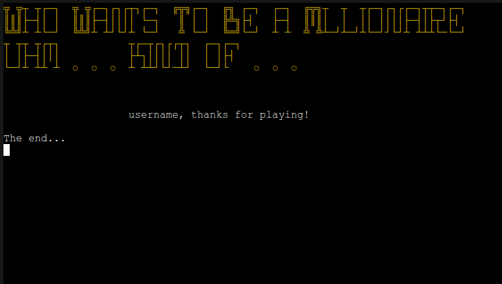
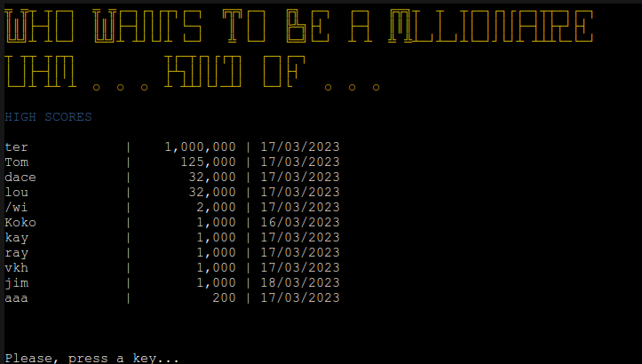

# Who Wants To Be A Millionaire Kind Of

[View the live project here](https://millionaire-kindof.herokuapp.com/)
## Table of contents
1. [Introduction](#Introduction)
2. [UX](#UX)
    1. [Ideal User Demographic](#Ideal-User-Demographic)
    2. [User Stories](#User-Stories)
    3. [Development Planes](#Development-Planes)
    4. [Design](#Design)
3. [Features](#Features)
    1. [Design Features](#Design-Features)
    2. [Existing Features](#Existing-Features)
    3. [Features to Implement in the future](#Features-to-Implement-in-the-future)
4. [Issues and Bugs](#Issues-and-Bugs)
5. [Technologies Used](#Technologies-Used)
     1. [Main Languages Used](#Main-Languages-Used)
     2. [Libraries And Modules Used](#Libraries-And-Modules-Used)
     3. [Frameworks And Programs Used](#Frameworks-And-Software-Used)
6. [Testing](#Testing)
     1. [Testing.md](TESTING.md)
7. [Deployment](#Deployment)
     1. [Deploying on Herokus](#Deploying-On-Heroku)
8. [Credits](#Credits)
     1. [Media](#Media)
     2. [Code](#Code)
9. [Acknowledgements](#Acknowledgements)
***

## Introduction
The game Who Wants To Be A Millionaire Kind Of is the 3rd Portfolio Project at the Code Institute. It is an hommage to the famous TV game that conquered the world. In this version, the questions are related to the movies.

The purpose of this project is to build a command-line application that allows the user to manage a common dataset about a particular domain.

[Back to top ⇧](#Who-Wants-To-Be-A-Millionaire-Kind-Of)

## UX
### Ideal User Demographic
There are two types of ideal users:
* New User
* Current User

### User-Stories
#### New User Goals
* As a new user, I want easily navigate through the application.
* As a new user, I want easily consult and find the rules.
* As a new user, I want to test my knowledge about the movies.
* As a new user, I want to have learn something while having fun.

#### Current User Goals
* As a current user, I want a game similar to the Who Wants To Be A Millionaire TV game.
* As a frequent user, I want to test my knowledge about the movies.
* As a frequent user, I want have questions with a progressive difficulty.
* As a frequent user, I want to improve my knowledge and score.

[Back to top ⇧](#Who-Wants-To-Be-A-Millionaire-Kind-Of)

### Development-Planes
To build a command-line application to give the user an experience similar to the one of the Who Wants To Be A Millionaire TV game, with the questions about movies.

#### Strategy
Strategy incorporates user needs as well as product objectives. This application will focus on the following target audience, divided into three main categories
* Audience
    * New Users
    * Current Users

* Demographic
    * All ages

* Psychographic:
    * Movie fan
    * Quiz fan
    * Problem solver

The application is supposed to enable the user to:
* Play the Who Wants To Be A Millionaire
* Insert a player name
* Answer to a series of randomly selected questions from the database
* Experience a progressive difficulty level
* Be aware of the points gained, threshold points and won points
* Know when answers wrongly and learn the correct answer
* Enter the high score databes if there are some points won at the game end
* Restart the game if wanted with a new set of questions
* Read the instructions about the game
* See the high scores from the database

The Developer/Administrator needs to receive:
    * Player's Name

#### Scope

After defining goals of the game, we are delineating the necessary features:
* Required functionalities
    * Intro screen display
    * Question database loader
    * How to play the game instructions display
    * High scores display
    * Global Menu
    * Quiz starter
    * Quiz questions generator
    * Points/Threshold display
    * Question display and guess
    * Answer validator
    * Correct answer displayed if wrongly answered or congratulatory message if answered correctly
    * On game end - displayed a new screen with appropriate messages, points and the high scores saved to Google Sheet
    * On application exit - displayed a new screen with Thank you note

#### Structure
A flowchart made in [LUCID](https://lucid.app.com/ "Link to Lucid") demonstrates the game's structure.

Flowchart Image

#### Skeleton
Being the game in fact a terminal application, the skeleton plane would be somwhat in between the presented flowchart and the design. Therefore, the relative details will follow in the next section. 

[Back to top ⇧](#Who-Wants-To-Be-A-Millionaire-Kind-Of)

### Design
The overall design of this command line application is quite simple. The developer at first decided to use different colours and ASCII text art. But, upon the deployment on Heroku, and some feedback from the testers, the developer opted for a more simpler design and less colourful in order to keep the best possible visibility of the application - beign a quiz game based on a lot of text that needs to be read.

For more engaging design, the devlopper has decided use a few screens at the intro, end game, end quiz, display high scores, etc. ASCII art is used for a games 'LOGO' that repeat itself throughout the application. For the passages from the screens, the developer opted for a simple keypress detection.

The interactive parts of the application are the user name insertion, the menu and the answering to the questions, which require a valid input and pressing of the 'Enter' key.

[Back to top ⇧](#Who-Wants-To-Be-A-Millionaire-Kind-Of)

## Features
### Existing Features
- **Different info screens**
    - These are presented in different moment of the game. Practically every feature is related to these screens, e.g.:
    

    
Screen Examples

    Intro Screen

    

    End Screen

    
    

- **Question database loader**
    * At the beginning of the application the json files are loaded with the data stored locally, but produced by the API https://the-trivia-api.com/. At first, the developer copied the data recevied into the code of another Python file that was imported to the main file. After organizing the data in json files, the developer integrated the code into main file. The three json files contain different difficulety level questions, and each 15 different ones.

    

- **How to play the game instructions display**
    * The instructions are read from the corresponding txt file and displayed on screen. They appear after the intro screen and later when chosen from the menu.

    

- **Player's Name Input**
    * After the instructions, the next screen requires user to enter they name. The valid input corresponds to a string containing only letters and of minimum 3 characters length.

    

- **Menu**
    * Menu is the central feature of the application. It gives to the user four possibilities to proceed: start quiz, show the instructions, show the high scores, or exit from the application.

    

- **Quiz function**
    * This functionality immediately generates 15 randomly selected questions, 5 of each level, through the dedicated Class. There are controllers which guarantee that the questions woudn't be repeated. Once that is over, the quiz starts with the first question. On the displayed screen, there are information about the point value of the question and the threshold (points guaranteed) if they were reached. Then appears the question and four answeres given with the letters a, b, c, and d as a choice. There's fifth option given to the user, that of q if they wish to quit the game with the so far accumulated points. If the wrong answer is given, the quiz ends and the points fall to the threshold. If none is reached, the quiz ends with 0 points, relative screen, and no high score saved. If the quiz ends with some points or the million is reached, different screens are presented and the score is saved in the high scores Google Sheet (name, points, date). After the end quiz screen, Menu returns.

    
    

- **High Scores Display**
    * This function first fetches the data from the high scores Google Sheet and then presents them in order of the points received. So, the most successful scores come first.

    

- **Game Exit**
    - If this choice is made, the game finishes with the thank you note to the user.

    

- **Slow print function**
    - This feature is present in almost every screen in the application. It gives the user the impression of an animation. In fact, it consists of the printing the characters of the string on by one with a time delay.

    

[Back to top ⇧](#Who-Wants-To-Be-A-Millionaire-Kind-Of)

### Features to Implement in the future
- The auxiliary features from the original TV game
     There are three auxiliary features in the original TV game: call a friend, ask the audience, and 50:50 options. Because of lack of time, the developer couldn't make it to implement these features. The complex algorithm for randomization with 80% of probabilty for the right answer of the first two features would have to wait for some other moment.
- The use of API for the questions
    The developer used the static JSON copy of the question from an API that had some limitations. Before the end of the project, the developer found one other API without the same limitations and without need of authentication to access the database, but didn't want to include it the final project. That was because the data structure was sligthly different and the developer didn't have time to properly test the API's reliability.

[Back to top ⇧](#Who-Wants-To-Be-A-Millionaire-Kind-Of)

## Issues and Bugs
Several issues were encountered during developement but the most troublesome are listed below.

- **Validation Errors**
In different moments of the development, the validation bugs happened. First one was the unrecognized choice of a letter when written as capital letter. That was immediately corrected by validating same letters, being capital or lower. Afterwards, with the username, the developer didn't take into consideration the possibility of user entering characters that weren't letters. That bug was pointed out by the mentor and surfaced again in the testing phase of the colleagues on Slack. That bug was also corrected. 

- **Quiz continuing even if quit selected**
There was a bug because of which the quiz continued although the user selected to quit. The error was due to selection of the possibilities of gaining only threshold points (as in choosing the wrong answer), whilst in quitting, the user can save all the points they won. That was also corrected.

- **Different display issues on Herokue**
When deployed on Heroku, the application had issues with the visibility of the ASCII art, and some selected colours were barely visible. That was pointed out by some colleagues from Slack in the testing phase. The developer decided to generate new ASCII art texts and select the plain colours to garantee the visibility of the text.

### Unfixed Bugs
There are no known unfixed bugs.

[Back to top ⇧](#Who-Wants-To-Be-A-Millionaire-Kind-Of)