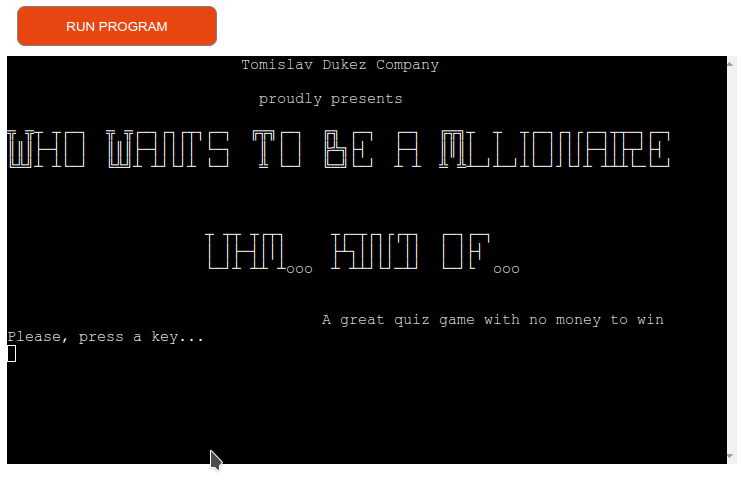
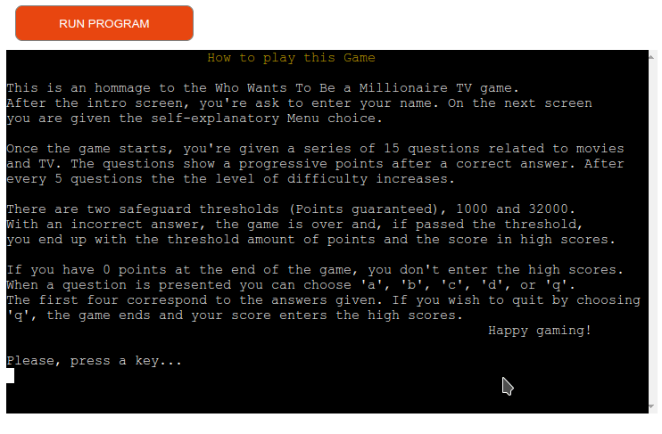
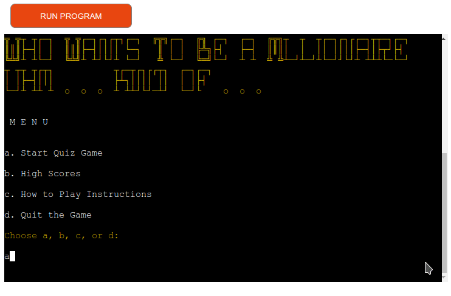
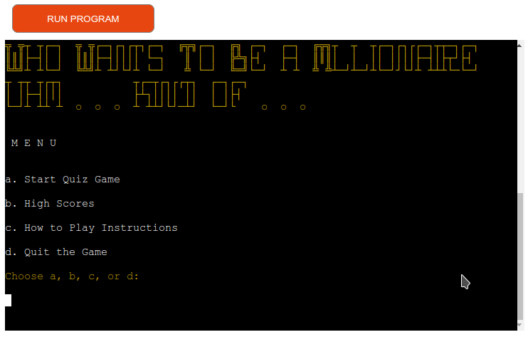
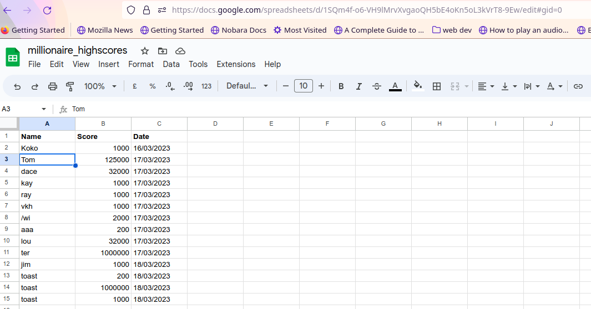
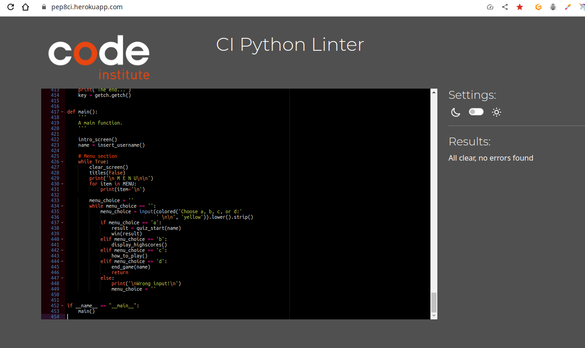

# Who Wants To Be A Millionaire Kind Of Testing Page

[Main README.md file](/README.md)

[View the live project here](https://millionaire-kindof.herokuapp.com/)

***
## Table of contents
1. [Testing User Stories](#Testing-User-Stories)
2. [Manual Testing](#Manual-Testing)
3. [Automated Testing](#Automated-Testing) 
     - [Code Validation](#Code-Validation)
4. [User Testing](#User-Testing)

***

## Testing User Stories
#### New User Goals
* As a new user, I want easily navigate through the application.
    * The indication how to continue are appearing on every screen (key press, enter the name, select choice).
    * Menu options are clear and self explanatory.
    * Answers selection or quit option is present during the quiz game.
* As a new user, I want easily consult and find the rules.
    * How to play this game instructions appear at the application start and can be chosen from the menu at any time.
    * Quiz game is similar to the TV Game and the rules are explained clearly and in detail.
* As a new user, I want to test my knowledge about the movies and TV.
    * The questions are generated from the The Trivia API of the category Movies and TV. There are also three levels of difficulty to test the knowledge of the user.
* As a new user, I want to have learn something while having fun.
    * The user is awarded by points and encouraged with every correct answer. If mistaken, the user can discover the right answer to the same question. If the points were awarded at the end of the game, the same are saved in the high score Google Sheet and the high scores can be seen at request from the Menu.
    * The questions are randomly selected, and the answers are always differently shuffled. That guarantees greater unpredictability and challenge.

#### Current User Goals
* As a current user, I want a game similar to the Who Wants To Be A Millionaire TV game.
    * Quiz game is similar to the TV Game and the rules are explained clearly and in detail.
* As a frequent user, I want to test my knowledge about the movies and TV.
    * The questions are generated from the The Trivia API of the category Movies and TV.
* As a frequent user, I want have questions with a progressive difficulty.
    * There are also three levels of difficulty to test the knowledge of the user and the difficulty progresses after every 5 questions.
* As a frequent user, I want to improve my knowledge and score.
    * The user is awarded by points and encouraged with every correct answer. If mistaken, the user can discover the right answer to the same question. If the points were awarded at the end of the game, the same are saved in the high score Google Sheet and the high scores can be seen at request from the Menu.

[Back to the top ⇧](#Who-Wants-To-Be-A-Millionaire-Kind-Of-Testing-Page)

## Manual Testing
### Application Start and Intro Screen
* Application start and intro screen is visible until the key is pressed (as indicated).

      

* After key is pressed, the new screen with instruction about how to play is displayed until the key is pressed (as indicated).

     

* After key is pressed, the new screen with request to the user to enter the user name is indicated together with the restrictions in choosing the name. The input is validated and, if invalid, the warning appears and the request is repeated until satisfactory input is given.

     

### Menu
* After a valid name is given, the menu screen appears. It requires writing the correct letter presented against the feature that is presented in the menu. The input is then validated. If successful, starts the chosen feature.

     

### Quiz Game
* After it is selected from the Menu, the quiz game starts immediately. Here are the common cases tested.

* No quiz win caused by a mistake and a threshold fall to 0, because no threshold point level has been reached.

     

* Quiz ended by a quit choice by user with reached points award and the score saved.

     

* End quiz caused by a mistake and a threshold fall to 1000 points, and the score saved.

     

* A million point quiz end, and the score saved.

     

### High Scores
* After it is selected from the Menu, the high score display appears, read from the Google Sheet, ordered by the points registered from the biggest.

     

     

### Game Exit
* After made the corresponding choice, the screen of Game Exit appears with a simple thank you note to the user.

    

[Back to the top ⇧](#Who-Wants-To-Be-A-Millionaire-Kind-Of-Testing-Page)

## Automated Testing
### Code Validation
* PEP8 CI Python Linter 

